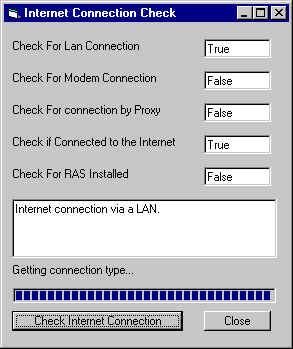



## Check for Internet Connection / Check for Network Connection

### Description

Check internet connection and return the type of connection used. example LAN connection, Modem connection, Connecting through Proxy, Remote Access Server installed (RAS installed). The source code and application screen shots are available at: http://www.imagineer-web.com/MasterKey/InetConnect.htm
 
### More Info
 

             |
---                |---
**Submitted On**   |2001-02-01 14:40:26
**By**             |[Ayman Elbanhawy](https://github.com/Planet-Source-Code/PSCIndex/blob/master/ByAuthor/ayman-elbanhawy.md)
**Level**          |Intermediate
**User Rating**    |4.6 (32 globes from 7 users)
**Compatibility**  |VB 3\.0, VB 4\.0 \(16\-bit\), VB 4\.0 \(32\-bit\), VB 5\.0, VB 6\.0
**Category**       |[Internet/ HTML](https://github.com/Planet-Source-Code/PSCIndex/blob/master/ByCategory/internet-html__1-34.md)
**World**          |[Visual Basic](https://github.com/Planet-Source-Code/PSCIndex/blob/master/ByWorld/visual-basic.md)
**Archive File**   |[CODE\_UPLOAD14585262001\.zip](https://github.com/Planet-Source-Code/ayman-elbanhawy-check-for-internet-connection-check-for-network-connection__1-14987/archive/master.zip)

